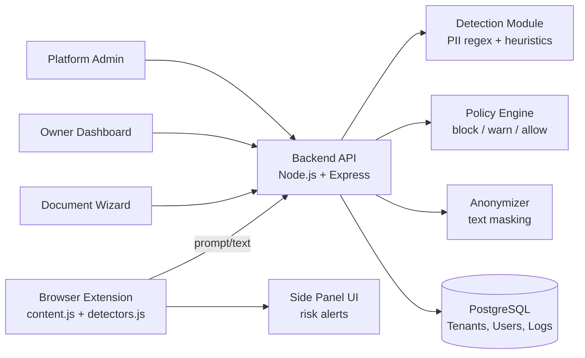

# 🛡️ SafeAI Assistant

**Browser extension + backend that stops PII and sensitive data from leaking into ChatGPT, Claude, Gemini, Grok, DeepSeek, and Perplexity — before you hit send.**


SafeAI Assistant is a SaaS security layer for SMBs that use public AI chat tools. It detects PII/sensitive data in prompts and documents in real time, anonymizes it, enforces tenant-level policy, and gives owners a dashboard + compliance report — all before data ever leaves the browser.

---

## 📸 Screenshots


## 📸 Admin Panel


---

## ✨ Features

- **Real-time PII detection** — names, emails, phone numbers, IDs, and bulk/tabular data flagged before sending
- **Prompt risk warnings** — inline LOW/MEDIUM/HIGH risk alerts placed next to the chat box, not a disruptive popup
- **One-click anonymization** — auto-masks sensitive text while preserving prompt intent
- **Document Wizard** — upload a file, ask questions, get answers with sensitive content stripped/anonymized first
- **Policy engine** — tenant-level rules to block, warn, or allow based on configurable policy
- **Owner dashboard** — scanned requests, blocked prompts, processed documents, usage charts
- **Monthly reporting** — exportable reports for clients/auditors
- **Compliance badge** — verifiable badge tenants can display to show they use SafeAI
- **Multi-platform support** — ChatGPT, Claude, Gemini, Grok, DeepSeek, Perplexity
- **Multi-tenant SaaS** — role-based access, tenant isolation, subscription tiers/billing
- **Multilingual** — English and Hebrew (i18n-ready for more)
- **Platform admin panel** — global stats and tenant management across all customers

---

## 🏗️ Architecture



**Request flow:** extension captures the prompt → sends to `/security/analyze` → policy engine decides → risky content is anonymized or blocked → result shown inline in the side panel.

---

## 📁 Project Structure

```
safeai-assistant/
├── extension/          # Chrome/Edge Manifest V3 extension (content scripts, side panel, popup)
├── backend/            # Node.js/Express API — detection, anonymization, policy, auth, billing
│   ├── modules/         # Analyzer, anonymizer, policy engine, prompt enhancer, encryption
│   ├── routes/          # auth, billing, dashboard, documents, personas, platform, prompts
│   ├── models/          # Document, Policy, SecurityLog, Tenant, User
│   └── services/        # Auth, Badge, Enhancement, LLM client, Telemetry, Wizard
├── admin-dashboard/     # Tenant-facing dashboard (reports, stats, policy toggles)
├── platform-admin/      # Cross-tenant admin panel
├── document-wizard/     # Safe document upload + Q&A workflow UI
└── docs/                # Deployment guides & screenshots
```

---

## 🚀 Getting Started

### 1. Backend

```bash
cd backend
npm install
cp .env.example .env      # fill in your own API keys — never commit real keys
npm start
```

### 2. Load the Extension

1. Open `chrome://extensions/`
2. Enable **Developer mode**
3. Click **Load unpacked**
4. Select the `extension/` folder

### 3. Configure

Open the extension side panel → **Settings** → enter your backend URL and account/API key.

---

## 🔌 Key API Endpoints

| Endpoint | Purpose |
|---|---|
| `POST /security/analyze` | Analyze text/prompt for sensitive data |
| `POST /security/anonymize` | Anonymize text based on findings |
| `POST /security/decide` | Apply policy decision (block/warn/allow) |
| `POST /api/documents/upload` | Upload document to the wizard |
| `GET /dashboard/stats` | Owner dashboard metrics |
| `GET /platform/global-stats` | Cross-tenant platform stats |
| `GET /health` | Health check |

---

## 🛠️ Tech Stack

- **Extension:** Manifest V3, vanilla JS, Vite build
- **Backend:** Node.js, Express, PostgreSQL
- **Deployment:** Railway / Render / Vercel / Docker (guides in `docs/`)

---
## 📸 Results


## ⚠️ Security Note

This repo ships an `.env.example`, not real credentials. Generate your own API keys for Gemini/OpenAI/Anthropic and your own `DATABASE_URL` — never commit a populated `.env` file.

---

## 📄 License

MIT — see [LICENSE](LICENSE).
